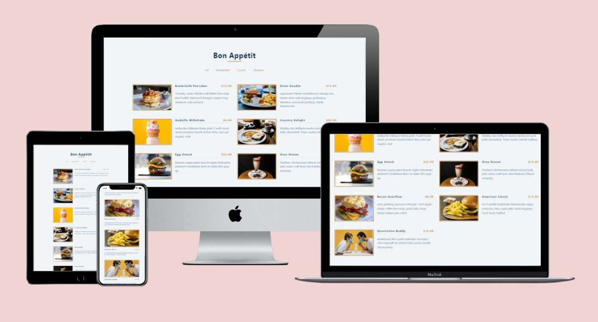

# Restaurant-menu

This is a restaurant menu project filtered by categories and built in react

## Built With

- Javascript
- React
- CSS

## Live Demo

[Live](https://mcihadkurel.github.io/restaurantmenu/)

## Available Scripts

In the project directory, you can run:

### `yarn start` or `npm start`

Runs the app in the development mode.\
Open [http://localhost:3000](http://localhost:3000) to view it in the browser.

The page will reload if you make edits.\

👤 **Author**

- Github: [@mcihadkurel](https://github.com/mcihadkurel)
- Twitter: [@mece_ka](https://twitter.com/mece_ka)
- LinkedIn: [@muhammed](https://www.linkedin.com/in/muhammed-cihad-8187581a8/)

## 🤝 Contributing

Contributions, issues and feature requests are welcome!

Feel free to check the [issues page](issues/).

## Show your support

Give a ⭐️ if you like this project!

## Acknowledgments

- Hat tip to anyone whose code was used
- Inspiration
- etc

## 📝 License

This project has no license